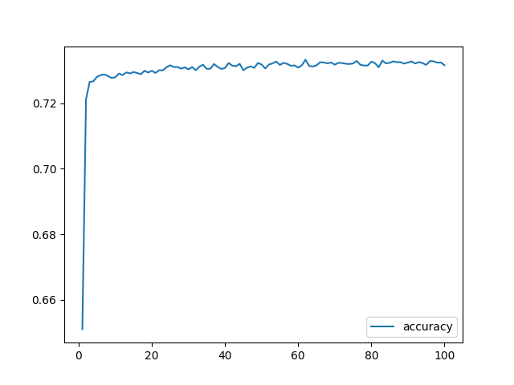
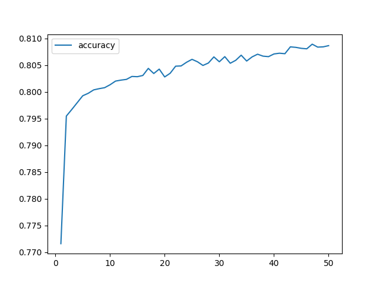

**Overview of the Analysis**

The purpose of this analysis is to develop a deep learning model that can predict whether a charity organization funded by Alphabet Soup is successful or not. The goal is to identify the key factors that contribute to a charity's success and create a model that can accurately classify charities as successful or unsuccessful.

**Results**

**Data Preprocessing**

* **Target Variable(s):** The target variable for our model is the "IS_SUCCESSFUL" column, which indicates whether a charity organization is successful or not.  
* **Feature Variable(s):** The feature variables for our model are the following columns:
   * EIN
   * NAME
   * APPLICATION_TYPE
   * AFFILIATION
   * CLASSIFICATION
   * USE_CASE
   * ORGANIZATION
   * STATUS
   * INCOME_AMT
   * SPECIAL_CONSIDERATIONS  
* **Removed Variable(s):** The following columns were removed from the input data because they are neither targets nor features:
   * EIN

**Compiling, Training, and Evaluating the Model**

* **Neural Network Architecture:** Our neural network model consists of 5 layers with 64, 32, 16, and 8 neurons for the hidden layers and only 1 neuron for the output layer. The "relu" activation function was chosen for the hidden layers as it is computationally efficient, introduces sparsity, and is less prone to the vanishing gradient problem. The "sigmoid" function was employed in the output layer to facilitate the modeling of probabilities, which is crucial in our binary classification problem.  
* **Model Performance:** The resulting model from the third attempt to optimize our original, achieved a target predictive accuracy of 80.1% on the test data, surpassing our goal of 75%.  
* **Attempts to Increase Model Performance:** As our initial model scored a 73.2% in predictive accuracy, to increase model performance, we tried the following:
   * Changing the "cutoff" amount for binning values in chosen columns ("name", "application_type", "classification", "ask_amt")
   * Removing columns ("status", "special_considerations")
   * Adding more hidden layers
   * Adding more neurons
   * Adjusting activation functions ("tanh", "relu", "softmax", "sigmoid")
   * Adjusting optimizer ("adam", "SGD")
   * Adjusting number of epochs
   * Retaining "name" column
   * Adding a "validation_split" parameter to the .fit() function

**Accuracy Plots**
* **Original Model**
  

* **Optimized Model**

**Summary**

In summary, our deep learning model was able to achieve a moderate level of accuracy in predicting whether a charity organization is successful or not. However, there is still room for improvement. One potential approach to improve the model's performance is to use a different type of model, such as a random forest or gradient boosting model, which may be better suited to handling the complex relationships between the feature variables. Additionally, collecting more data or using techniques such as data augmentation may also help to improve the model's performance.

**Recommendation**

Based on our analysis, we recommend using a random forest model to solve this classification problem. Random forest models are well-suited to handling complex datasets with multiple feature variables and can often achieve high levels of accuracy. Additionally, random forest models are relatively easy to interpret and can provide valuable insights into the relationships between the feature variables and the target variable.
